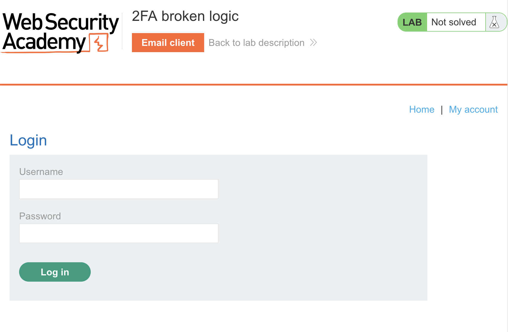
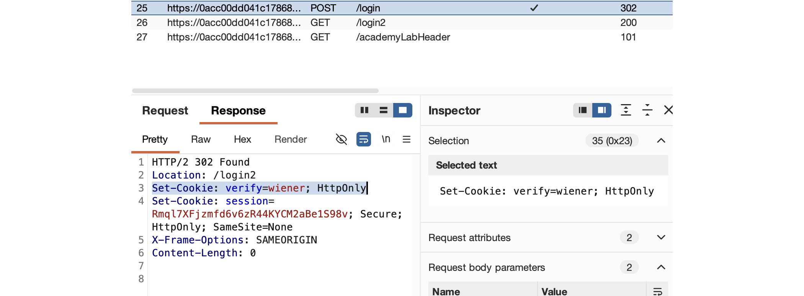
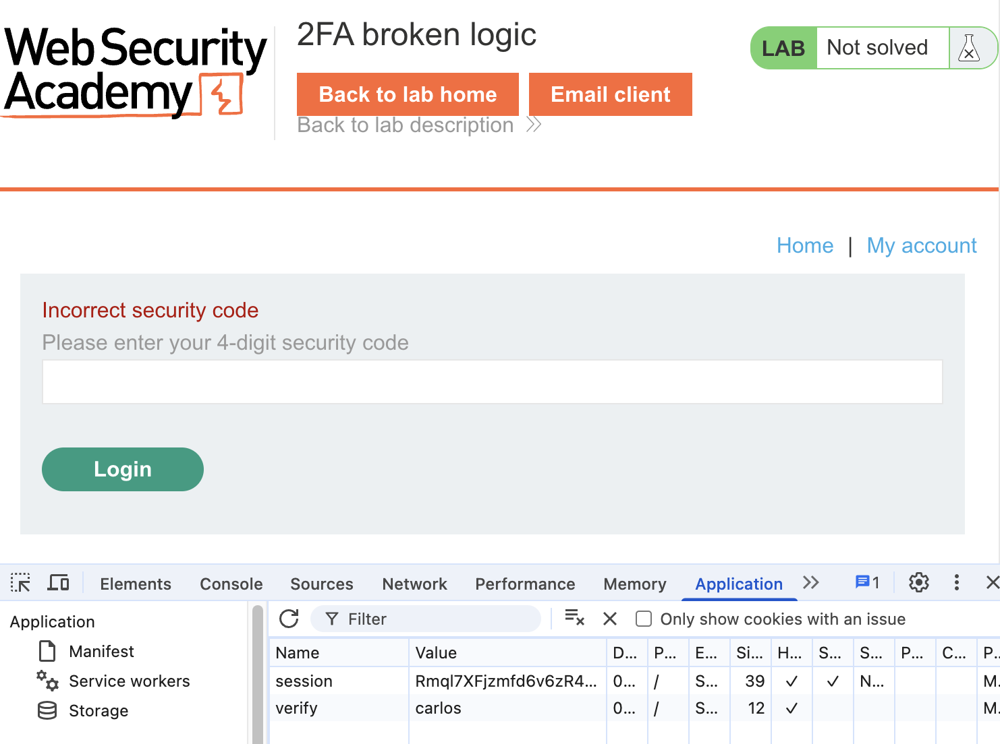
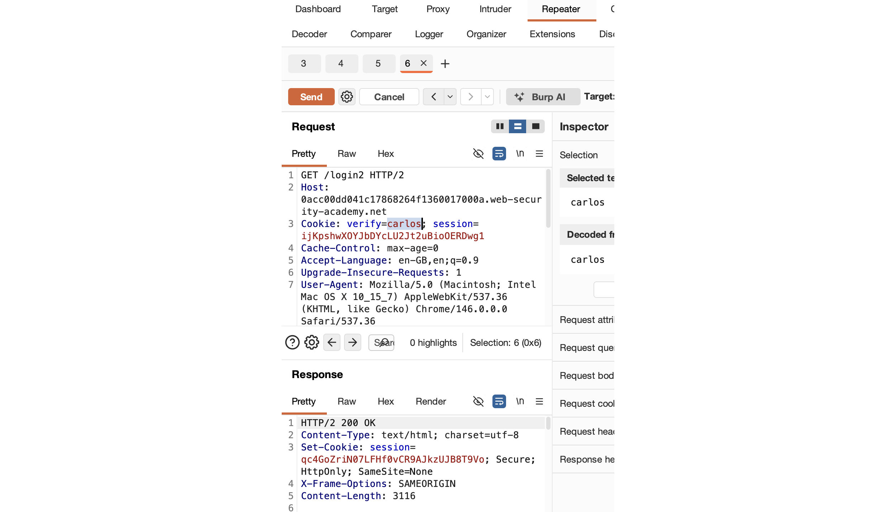
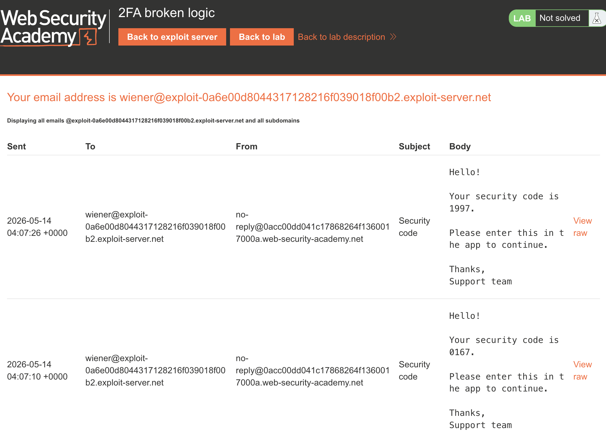
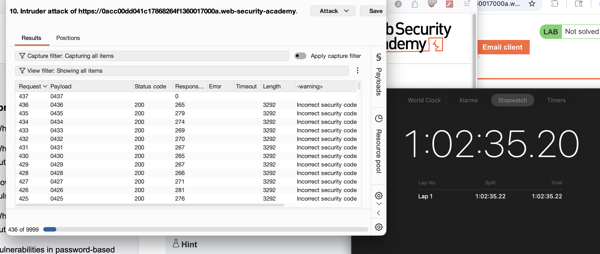
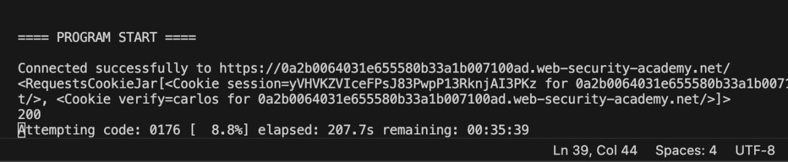
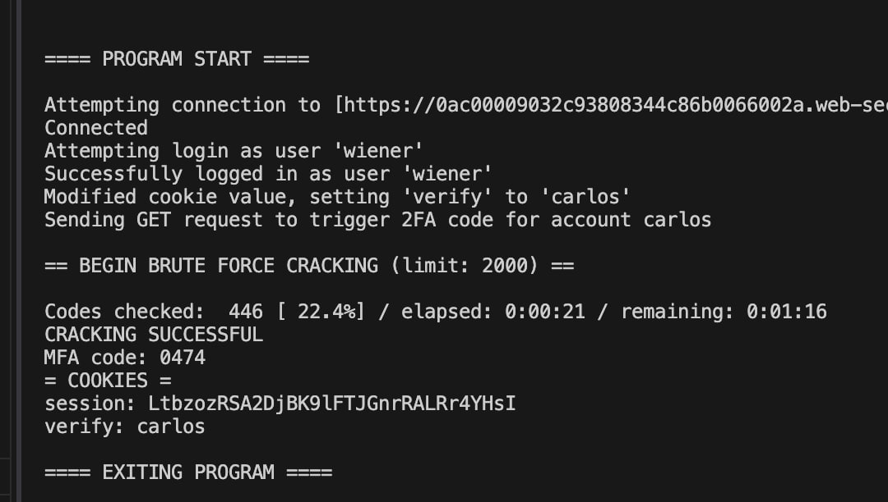
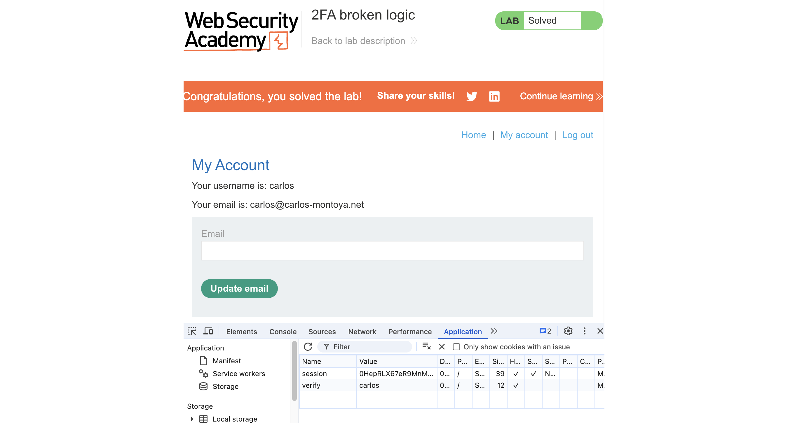

# Solution: PortSwigger Lab: 2FA Broken Logic
PortSwigger Web Security Academy - Authentication Vulnerabilities ([link](https://portswigger.net/web-security/learning-paths/authentication-vulnerabilities/vulnerabilities-in-multi-factor-authentication/authentication/multi-factor/lab-2fa-broken-logic#))

Difficulty: PRACTITIONER

## OVERVIEW

For this lab, we need to access the account of a target user, "carlos". We know their username, but we don't know their password, or have access to their email. 

We do have our own login credentials, and access to our own email to complete our 2FA.

## ANALYSIS

The login process involves the main login page (/login), and a 2nd page (/login2) where you enter the 2FA code emailed to you. You're then redirected to your account page.

❌ We can't access Carlos' account by simply changing the parameters in the URL. (eg web-security-academy.net/my-account?id=carlos) No IDOR vulnerability here.

Since we don't know his password, the only real way forward is exploiting the 2FA mechanism.

Interestingly, the /login POST Response sets two cookies: A session token, and the username we're trying to access. Since we can change the cookie locally, obviously we can try changing this to "carlos", and then completing 2FA using our own code.

❌ This doesn't let us login. It seems our own 2FA code doesn't work for Carlos' account. 

💡 There is good news, though. It seems that this method of modifying the cookie will let us attempt to log into Carlos' account by guessing the 2FA code, even without knowing what his password is.

The problem is, we don't know if there even is a 2FA code for Carlos. We won't be able to brute force it if a code hasn't been generated yet.

We're able to observe that the 2FA email is triggered by the GET /login2 Request. We can trigger these repeatedly using the Burp Suite Repeater, getting status code 200.

Changing the value of "verify" in the Repeater to junk will result in a status code 500 error. Changing it to "carlos" results in status code 200. This is a username enumeration vulnerability, even though we already know carlos' account exists. 

💡 In theory, this "carlos" /login2 Request SHOULD trigger a 2FA code for their account. We can't know if this actually works or not without peeking behind the scenes, but we have to make an educated guess and hope for the best. The status code 200, same as our own login triggering the 2FA code, seems to indicate it will work. 

💡 As an aside, the 4-digit 2FA codes appear to always start with a 0 or a 1. Out of 9 codes, 7/9 started with a zero and only 2/9 started with a one. 

So, we now have:
- a way to trigger the 2FA code
- a way to attempt logging in by providing a 2FA code

## EXECUTION

First, we trigger Carlos' 2FA code, using the Repeater.

Sending the POST /login2 Request to the Burp Suite Intruder, we can easily set up a simple Sniper Attack to brute force the MFA code. We can use Grep - Extract to highlight the warning message to see if anything interesting comes up, though this isn't strictly necessary.

That should solve the problem. Hooray!

... Except, there is one slight problem. Nothing to do with my method, but to do with Burp Suite itself.

The free Community version of Burp Suite is slow. Like, REALLY slow. 

It finished checking 436/10000 codes, 3.7% total, in 1 hour, 2 minutes and 35 seconds. At this rate, it's going to take 28 hours and 14 minutes to finish checking all the possible codes! 💀

I ain't got time for that! But also, I have no idea how to do any of this without using Burp Suite...

... So I Googled a bunch of networking stuff, and realised that I can create a program to do the exact same thing Burp Suite is doing in Python. Except my program won't be artificially throttled. Let's do that instead!

I've never written anything like this before, but let's give it a shot!

## SCRIPT

[2faBrokenLogic.py](2faBrokenLogic.py)

The script follows the same logic as what I previously did through Burp Suite. In short:
- prompt the user for the URL of their lab session
- check that we can connect to the lab
- log in using the given credentials
- overwrite the "verify" cookie value to be "carlos"
- trigger the 2FA code for carlos
- begin brute forcing the 2FA code

The initial version was single threaded, and would take at most 40 minutes to complete the brute force cracking.

I then implemented multithreading, which reduced the time to about 2 minutes. Compared to the Burp Suite estimate, that's roughly **847 times faster**. 😁

The program also has a lot of UI user-friendliness, error checking, and visual information. It prints the progress out visually, so you get a lot of feedback while it's running. It's completely superfluous, but I love that stuff!

Because I noticed that the 2FA codes always start with 1 or 0, I limited the brute force to only go up to 2000. This doesn't change how quickly it finishes, but it does give a more accurate ETA to the user while it's running.

For reference, Burp Suite was still running in the background while I put this Python script together, and was nowhere near completion. It was faster for me to learn how to do this in Python than it was to use Burp Suite... So yeah, this was definitely the right approach.

## RESULT

When the script finishes, the MFA, session ID and verify values are all ready to copy and paste either into Burpe Suite, or directly into a web browser.

## REMEDIATION

As a lab, this exploit relies on the login process being handled in a very poorly designed way:
- MFA codes can be guessed indefinitely, with no lockout mechanism to prevent brute force attempts
- The app relies on client-side verification to know who the user is verifying their MFA as, which can be manipulated by editing a plaintext value in the browser's cookies
- The session token is not tethered to the user, and is still valid even if the username is modified
- MFA code generation happens every time the /login2 page is accessed, and in no way relies on the server validating a user's login credentials. You only need one valid login to access the /login2 page, and then you can generate 2FA codes for any user
- Passwords offer almost no security here because they can be completely bypassed. Basically if you have one user's password (or register your own), you have everyone's password