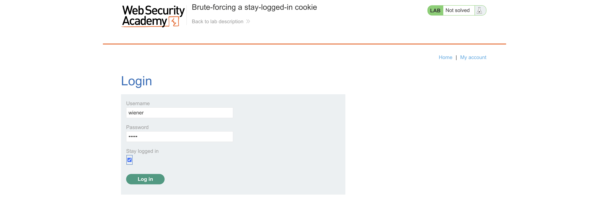
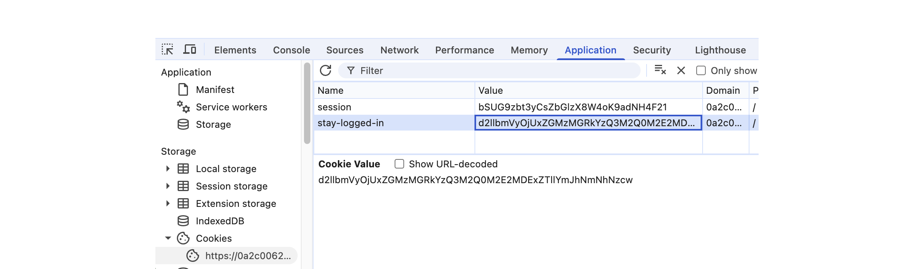
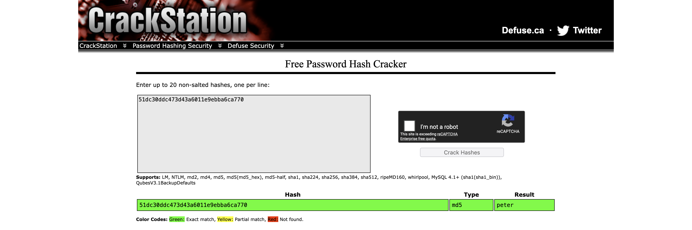
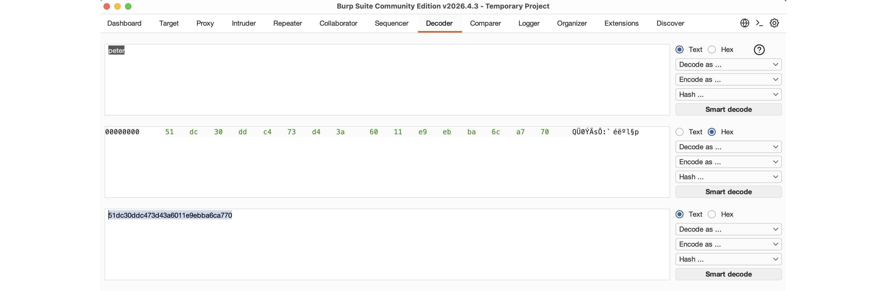
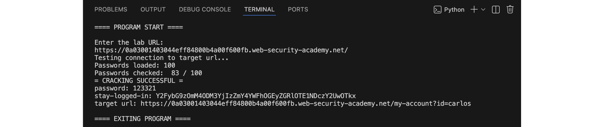
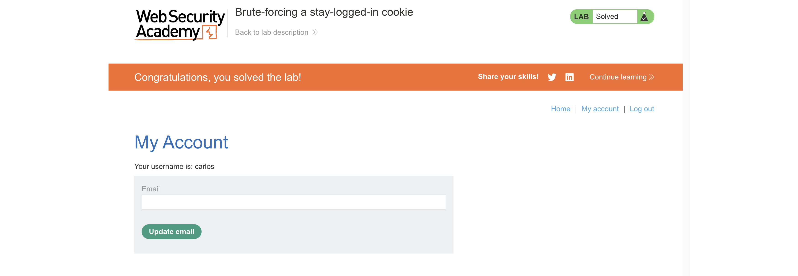

# Solution: PortSwigger Lab: Brute-forcing a stay-logged-in cookie
PortSwigger Web Security Academy - Authentication Vulnerabilities ([link](https://portswigger.net/web-security/learning-paths/authentication-vulnerabilities/vulnerabilities-in-other-authentication-mechanisms/authentication/other-mechanisms/lab-brute-forcing-a-stay-logged-in-cookie#))  
Difficulty: PRACTITIONER

## OVERVIEW

Access a target user's account by generating a fake "stay logged in" browser cookie. To do this we need to "reverse-engineer" a valid cookie.

## ANALYSIS

We'll log in as usual with our "wiener:peter" login credientials.



This time, the login page includes a "stay logged in" checkbox. If this is turned on, then the browser will add a "stay-logged-in" cookie, in addition to the usual session token.



The cookie value is "d2llbmVyOjUxZGMzMGRkYzQ3M2Q0M2E2MDExZTllYmJhNmNhNzcw", which at a glance seems like unparseable, encoded data. That said, it's extremely common for cookies to be encoded with Base64, which we can try decoding directly in the browser's console:

```
atob("d2llbmVyOjUxZGMzMGRkYzQ3M2Q0M2E2MDExZTllYmJhNmNhNzcw")
```

Results in:

```
wiener:51dc30ddc473d43a6011e9ebba6ca770
```

We have a pretty clear "username:string" line of data. We can reasonably assume that the string is something that the web app uses as our password. 

This string happen to be exactly 32 characters long, and only contains alphanumeric characters. These traits indicate that it's almost certainly an MD5 hash.

An MD5 hash can be reversed through brute force. It can also be quickly checked using a lookup table, for example through the website CrackStation:



Using CrackStation, we can see that the hash is just our password, hashed in MD5 format.

If we already suspected this may be the case, then we could test our theory by taking our password and hashing it to MD5. We can't do this in the browser console, but Burp Suite does have a "Decoder" section for this functionality:



Entering our password of "peter", hashing to MD5, then converting to ASCII, results in "51dc30ddc473d43a6011e9ebba6ca770".

We've completely reverse-engineered the "encryption" process this website uses. It doesn't use encryption at all... Just Base64 encoding and an MD5 hash of the user's password.

To break into our target's account, we can generate a valid "stay logged in" cookie, and have the app skip all authentication processes. Essentially it'd be like we were using their own browser session on our own device.

## EXECUTION

The free version of Burp Suite can't automate generating MD5 hashes, so we'll need to write our own script to do that. If we're already doing that, we may as well solve the entire lab with a script, anyway.

## SCRIPT

[bruteForceStayLoggedInCookie.py](bruteForceStayLoggedInCookie.py)

This script does the following:
- connect to the lab
- load all passwords from "passwords.txt"
- generate a "stay logged in" cookie in the correct format for each password
- attempt to log in with every cookie until we've brute forced it



When the script finishes, it clearly outputs:
- plaintext password
- cookie "stay-logged-in" value
- URL to access



Inputing the cookie and accessing the URL will give us the target user's account page, completing the lab.

## REMEDIATION

This website's "encryption" process is completely insecure.
- MD5 is not a secure cryptographic hashing method, and has been depreciated.
- No salt. Here, the hash is simply the user's password, with no modification whatsoever, nor any actual encryption.
- The user's username is included in the cookie. If the cookie were stolen, an adversary can instantly identify what login this cookie provides. The cookie should be verified server-side, with only the web app knowing who it belongs to.
- The web app's design uses "stay logged in" cookies as a client-side shortcut that anyone can generate. The "stay logged in" session is not generated by the web app, so it can be forged for any user, even if they never logged in with that option.